# Introdução

Informações básicas do projeto.

* **Projeto:** Lotação em transporte público
* **Repositório GitHub:** https://github.com/ICEI-PUC-Minas-PPLCC-TI/ti-1-ppl-cc-m-2024-2-g10-lotacao-em-transporte-publico.git
* **Membros da equipe:**

  * [Pedro Henrique C. Quinellato](https://github.com/PedroQuinellato)
  * [Guilherme Leão Rabelo](https://github.com/gleaor)

A documentação do projeto é estruturada da seguinte forma:

1. Introdução
2. Contexto
3. Product Discovery
4. Product Design
5. Metodologia
6. Solução
7. Referências Bibliográficas

✅ [Documentação de Design Thinking (MIRO)](https://github.com/ICEI-PUC-Minas-PPLCC-TI/ti-1-ppl-cc-m-2024-2-g10-lotacao-em-transporte-publico/blob/master/docs%2Ffiles%2FPPLCC-M%20-%20G10%20-%20Lota%C3%A7%C3%A3o%20no%20transporte%20p%C3%BAblico.pdf)

# Contexto

**A lotação é um dos problemas mais frequêntes quando o assunto é transportes públicos e isso faz parte de uma série de fatores como a falta de investimentos na infraestrutura e no trânsito nas grandes cidades, em uma nova Pesquisa CNT de Mobilidade da População Urbana, lançada nesta quarta-feira (7) com o apoio da Associação Nacional das Empresas de Transportes Urbanos (NTU), A pesquisa ouviu 3.117 pessoas presencialmente em seus domicílios, em 319 municípios com mais de 100 mil habitantes, Segundo os números da pesquisa, o ônibus permanece essencial, sendo a única opção de locomoção para 53% dos usuários. A população de baixa renda, identificada como classes C e D/E, é a que mais utiliza ônibus (79%), trem urbano/metropolitano (77%) e metrô (62%). No entanto, os usuários apontam a necessidade de melhorar o serviço. Entre os principais problemas citados estão conforto, segurança, preço da tarifa e idade dos ônibus.**

## Problema

**O problema são as causas da lotação, uma nova pesquisa divulgada pelo Moovit, aplicativo de rotas para pedestres, perguntou a passageiros de transporte público o que os faria se sentir mais seguros nos modais. 83% pediram o aumento da frota para evitar veículos lotados, mas sabemos que aumentar a quantidades dos transportes só complicaria ainda mais os problemas de tráfico, para 59%, a informação sobre a localização dos ônibus em tempo real seria útil para evitar a aglomeração em pontos e paradas, essa abordagem é util para ter um controle maior do gerenciamento de tempo e viajem nos transportes públicos.**

## Objetivos

**O nosso objetivo é, pelo meio de nossa solução, proporciar às pessoas que dependem de transporte público rotas alternativas que possam ser mais baratas e rápidas. Através disso, temos como objetivo também diminuir a lotação em ônibus e metrôs, utilizando da nossa tecnologia para conectar usuários com rotas mais eficientes e assim dispersando os mesmos de rotas muito utilizadas.**

## Justificativa

**Um dos principais motivos para o desenvolvimento das ideias do nosso projeto é a necessidade de ter algum método que ajude contra a lotação dos transportes públicos e alternativas de transportes que sejam mais rápidas e baratas de forma que os transportes públicos como ônibus/metro não sejam as unicas opções viáveis no dia a dia**

## Público-Alvo

**A princípio o nosso público-alvo seria as pessoas que diariamente usam os transportes públicos como ônibus/metro que estejam na margem de 20 até 30 anos**

# Product Discovery

## Etapa de Entendimento
>\
> **.png)**
> 
> **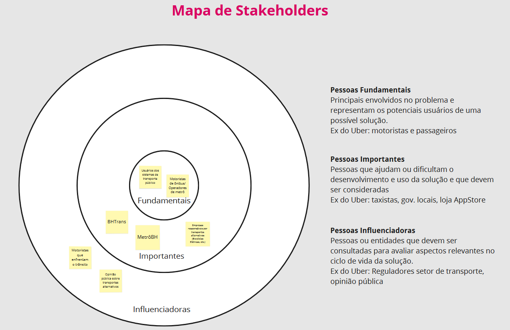**
> 
> **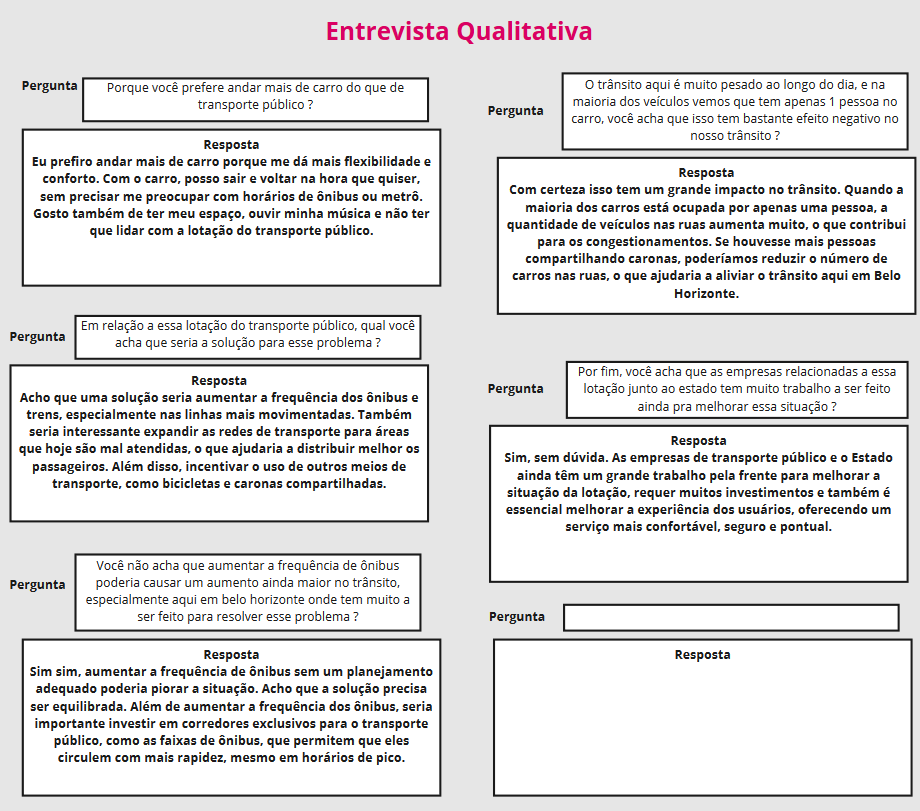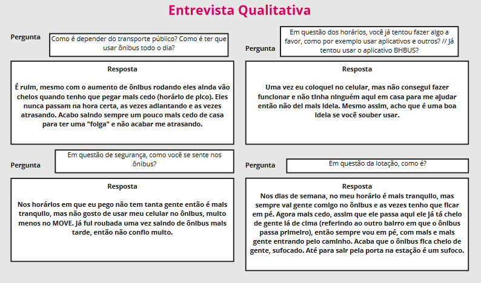**
> 
> **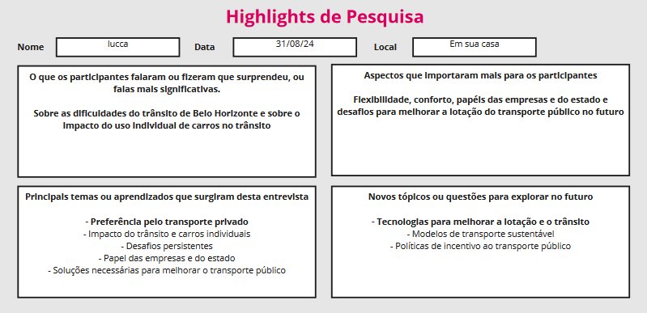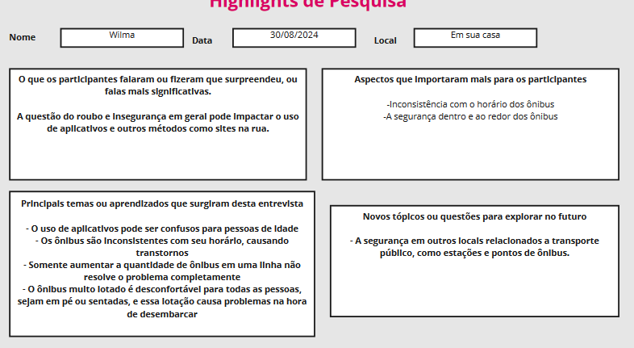**
> 
## Etapa de Definição

### Personas

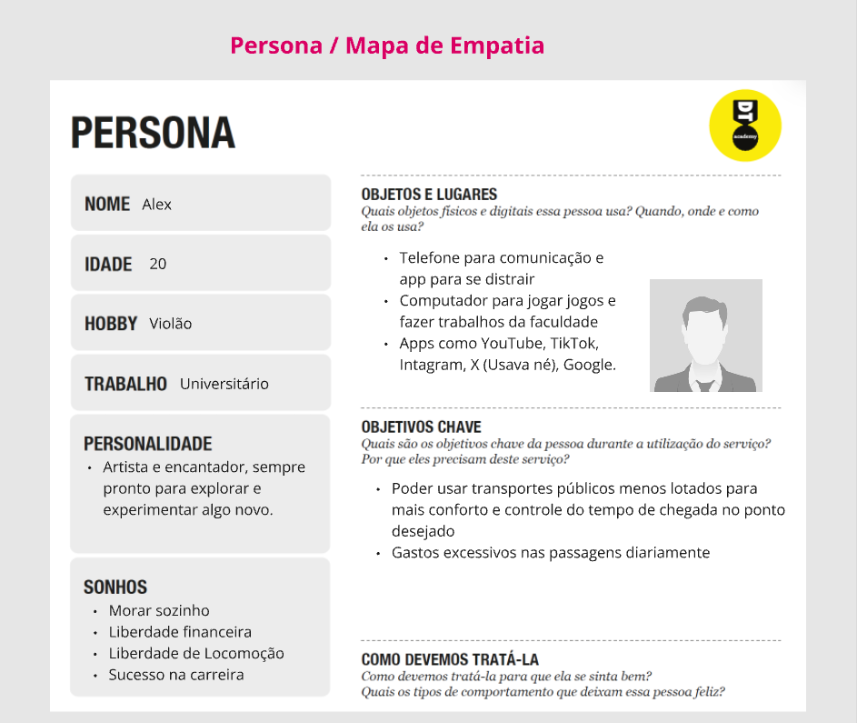

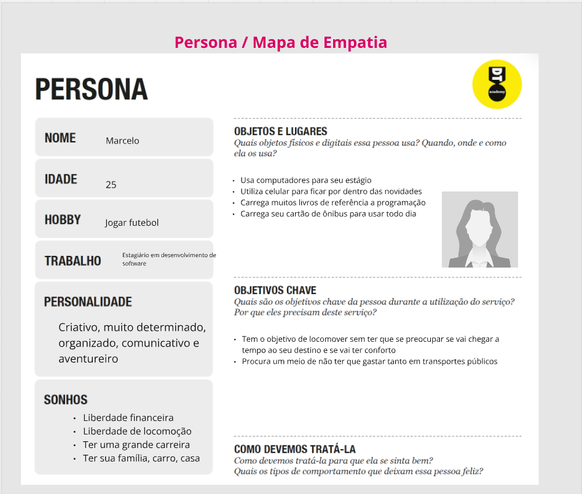

# Product Design

Nesse momento, vamos transformar os insights e validações obtidos em soluções tangíveis e utilizáveis. Essa fase envolve a definição de uma proposta de valor, detalhando a prioridade de cada ideia e a consequente criação de wireframes, mockups e protótipos de alta fidelidade, que detalham a interface e a experiência do usuário.

## Histórias de Usuários

Com base na análise das personas foram identificadas as seguintes histórias de usuários:

| EU COMO...`PERSONA` | QUERO/PRECISO ...`FUNCIONALIDADE`        | PARA ...`MOTIVO/VALOR`               |
| --------------------- | ------------------------------------------ | -------------------------------------- |
| Usuário do transporte público   | Rotas de ônibus alternativas | Não ficar desconfortável num ônibus lotado            |
| Usuário do transporte público        | Rotas mais baratas      | Poder economizar na minha rotina diária |
| Usuário do transporte público | Certeza sobre o horário em que os ônibus passam | Poder evitar imprevistos e atrasos |

## Proposta de Valor

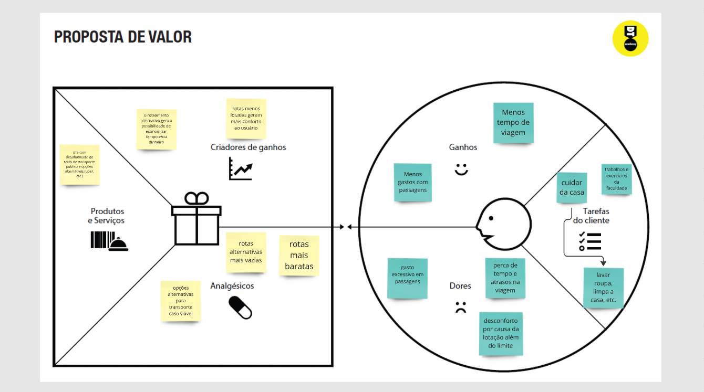

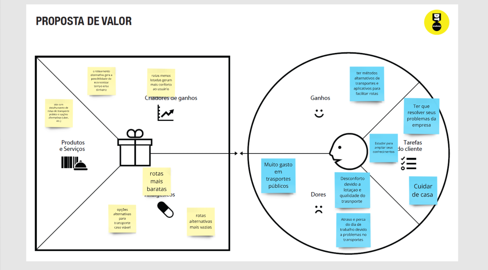

## Requisitos

As tabelas que se seguem apresentam os requisitos funcionais e não funcionais que detalham o escopo do projeto.

### Requisitos Funcionais

| ID     | Descrição do Requisito                                   | Prioridade |
| ------ | ---------------------------------------------------------- | ---------- |
| RF-001 | Cadastro | ALTA       |
| RF-002 | Roteamento | ALTA      |
| RF-003 | API do mapa | ALTA       |
| RF-004 | Pesquisa de rotas | ALTA      |
| RF-005 | Funções do menu | MÉDIA       |

### Requisitos não Funcionais

| ID      | Descrição do Requisito                                                              | Prioridade |
| ------- | ------------------------------------------------------------------------------------- | ---------- |
| RNF-001 | O sistema deve ser responsivo para rodar em um dispositivos móvel| MÉDIA     |
| RNF-002 | O sistema deve ser simples para o facíl acesso de pessoas mais velhas           | BAIXA      |

## Projeto de Interface

Artefatos relacionados com a interface e a interacão do usuário na proposta de solução.

### Wireframes

##### Página de navegação

Um menu de navegação com opções de interação com perfil do usuário, histórico de viagens, opçôes de partida e destino, informações sobre o projeto e mapa da região.

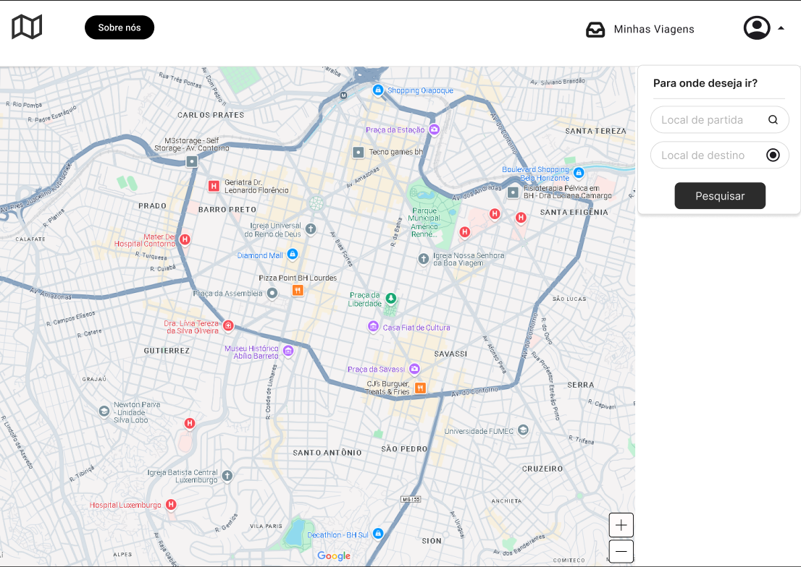

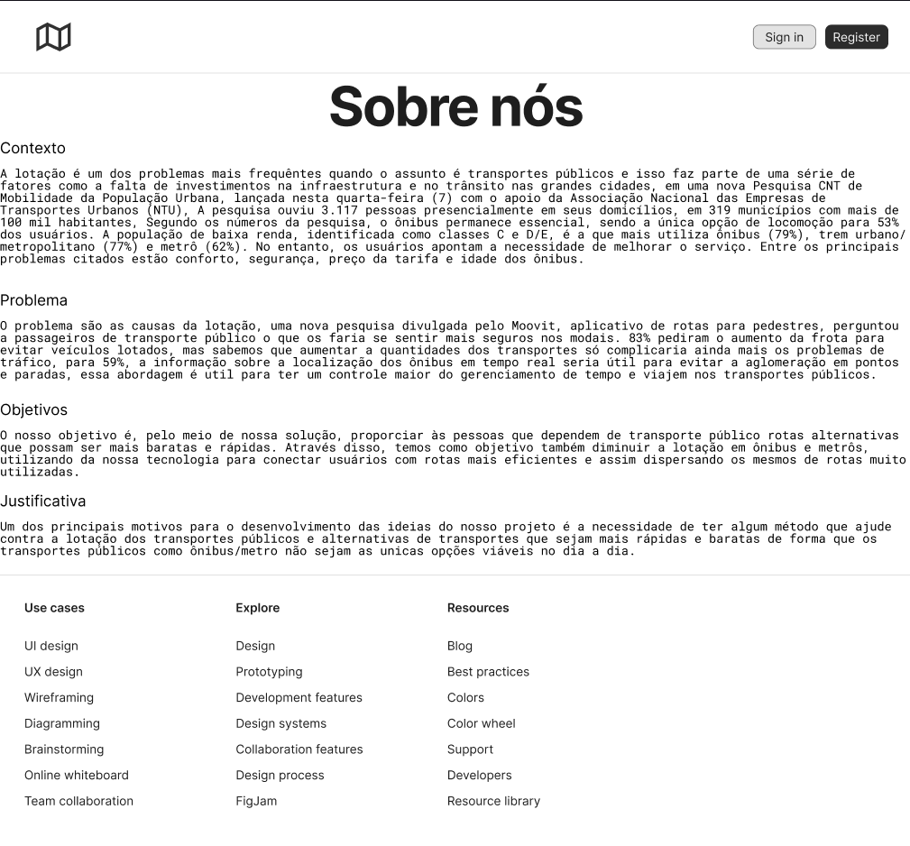

### User Flow

.png)

### Protótipo Interativo

✅ [Protótipo Interativo (MarvelApp)](https://marvelapp.com/prototype/8j8gj03)

# Metodologia

Usamos como base para o wireframe sites como uber e google maps, aa principal ferramenta para produzir o wireframe foi o figma e para o protótipo iterativo usei o marvel; as informações foram a maioria de conhecimento do dia a dia como passageiro de onibus mas também tiveram pesquisas para uma melhor apuração nas informações e ter elas da forma mais atualizadas; a parte de etapa de entendimento foi usada informações e imagens guardadas no miro do nosso grupo.

## Ferramentas

Relação de ferramentas empregadas pelo grupo durante o projeto.

| Ambiente                    | Plataforma | Link de acesso                                     |
| --------------------------- | ---------- | -------------------------------------------------- |
| Processo de Design Thinking | Miro       |  https://github.com/ICEI-PUC-Minas-PPLCC-TI/ti-1-ppl-cc-m-2024-2-g10-lotacao-em-transporte-publico/blob/master/docs%2Ffiles%2FPPLCC-M%20-%20G10%20-%20Lota%C3%A7%C3%A3o%20no%20transporte%20p%C3%BAblico.pdf        |
| Repositório de código     | GitHub     |   https://github.com/ICEI-PUC-Minas-PPLCC-TI/ti-1-ppl-cc-m-2024-2-g10-lotacao-em-transporte-publico.git    |
| Protótipo Interativo       | MarvelApp  | https://marvelapp.com/prototype/8j8gj03   |

## Gerenciamento do Projeto

Nesse projeto passamos por alguns imprevistos com os participantes limitando a quantidade de pessoas que poderiam participar, e também a falta de conhecimento em algumas ferramentas , mas com a ajuda do professor e da equipe conseguimos superar esses obstáculos, planejamos reuniões e organizamos as atividades para que todos pudessem contribuir de forma eficaz e equivalente para não sobrecarregar ninguém. Além disso, utilizamos o Miro para registrar as ideias e discussões, o que ajudou a administrar o tempo e a priorizar as atividades e seu público alvo.

# Solução Implementada

No início nós pensamos em um app que pudesse ter rotas alternativas para o usuário, mas ao longo do projeto percebemos que o problema da lotação nos transportes públicos é algo muito complexo para tentar resolver em um app só, por isso nosso grupo procurou uma alternativa que vimos muito prática, o intuito do nosso app é registrar ônibus e sus linhas, para ter livre conhecimento dos seus pontos existentes e achar as linhas com maior facilidade.

## Vídeo do Projeto

O vídeo a seguir traz uma apresentação do problema que a equipe está tratando e a proposta de solução. ⚠️ EXEMPLO ⚠️

[](https://www.youtube.com/embed/70gGoFyGeqQ)

## Funcionalidades

Cadastro de linhas dos Ônibus

Permite a inclusão, leitura, alteração e exclusão de contatos para o sistema

* **Estrutura de dados:** [linhas][pontos]
* **Instruções de acesso:**
  * Abra o site
  * Acesse o menu principal e escreva o número da linha e seu tipo
  * Em seguida, adicione seus pontos
* **Tela da funcionalidade**:


Registro de horários

* **Estrutura de dados:** [linhas][pontos]
* **Instruções de acesso:**
  * Abra o site
  * Acesse o menu principal e veja os horários cadastrados
* **Tela da funcionalidade**:
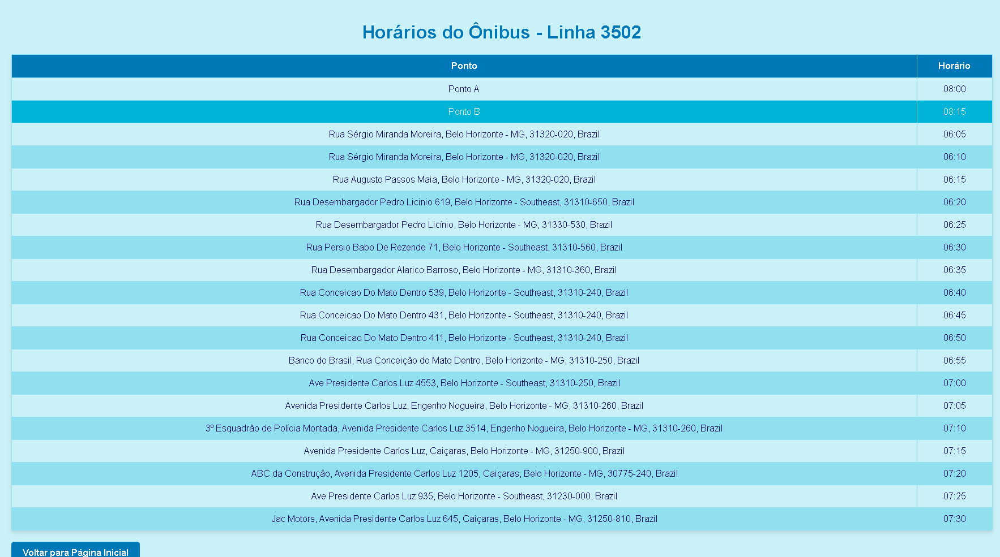

Linhas pesquisadas

* **Estrutura de dados:** [linhas][pontos]
* **Instruções de acesso:**
  * Abra o site
  * Acesse o menu principal e ver o meu histórico
* **Tela da funcionalidade**:
  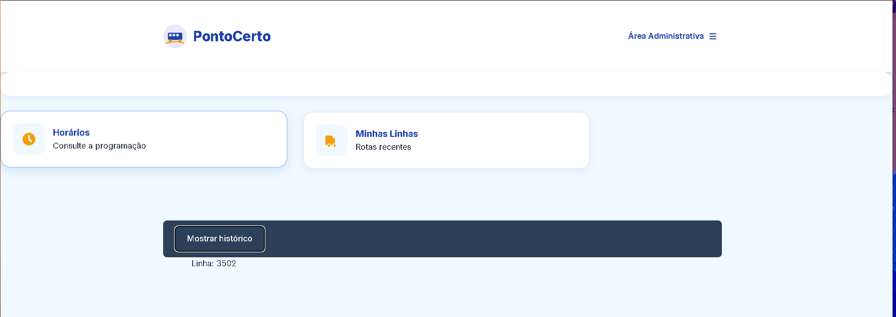

## Estruturas de Dados


Registro das linhas já cadastradas dentro o sistema

```json
 "linhas": [
    {
      "id": "1",
      "numero": "3502",
      "tipo": "Comum"
    },
    {
      "id": "2",
      "numero": "355",
      "tipo": "Comum"
    }
 ],
  
```

Registro dos pontos já cadastrados

```json
 "pontos": [
    {
      "id": "1",
      "linha": "3502",
      "latitude": -19.878853909942613,
      "longitude": -43.98593263294486
    },
    {
      "id": "2",
      "linha": "3502",
      "latitude": -19.8788688174539,
      "longitude": -43.98593966137369
    },
    {
      "id": "3",
      "linha": "3502",
      "latitude": -19.87812471190135,
      "longitude": -43.9851457275154
    }
 ],
```

## Módulos e APIs

Esta seção apresenta os módulos e APIs utilizados na solução

**Images**:
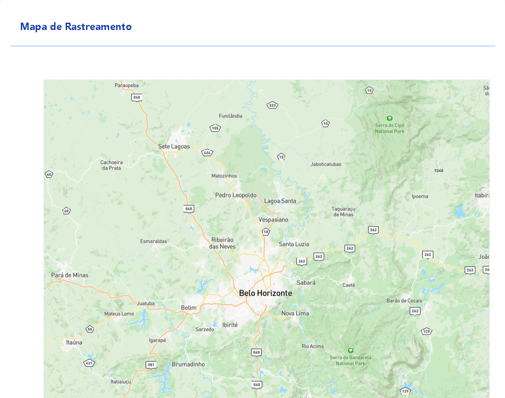

**Scripts:**
Usamos APIs como Mapbox para obter informações de localização e pontos de interesse, e a API do geoapify para usar geolocalização reversa para registrar o nome das ruas de acordo com suas lat e lon.


# Referências

As referências utilizadas no trabalho foram:

https://automotivebusiness.com.br/pt/posts/mobility-now/83-dos-passageiros-querem-mais-veiculos-no-transporte-para-evitar-lotacao/

https://www.jota.info/jotinhas/mobilidade-urbana-transporte-publico-segue-indispensavel-aponta-pesquisa-cnt

https://noticias.r7.com/minas-gerais/cidade-a-cidade-transporte-publico-continua-sendo-avaliado-como-principal-problema-de-bh-22112023/
